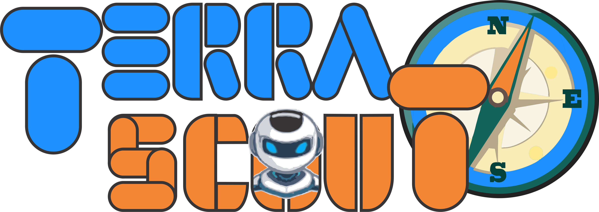
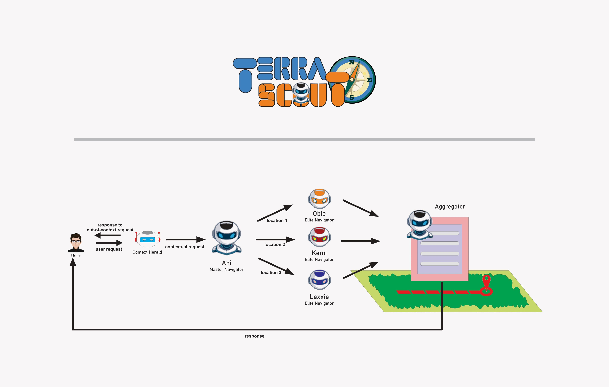

# 🌍 TerraScout — Multi-Agent Geo-Navigation System  [28-11-2025]

A powerful agent-orchestrated system that transforms location-based queries into **structured, actionable intelligence**.

---
Ensure to view important notes below

## 🏛️ Architecture — The Agentic Core



Below is a high-level visualization of the TerraScout workflow:

### **🟪 TerraScout (SequentialAgent) — Main Orchestrator**
Controls the overall flow, ensuring every agent runs in the correct order.

---

### **🟥 Context Herald (LlmAgent) — Gatekeeper**
🛑 First checkpoint.  
Rejects non-geo-related queries to save resources and prevent unnecessary computation.

---

### **🟩 Master Navigator Ani (Agent) — Dispatcher**
🗺️ Uses the Maps Tool to locate the **three best candidate locations**, then prepares the parallel workload.

---

### **🟨 Elite Navigators (ParallelAgent) — Deep Searchers**
⚡ Runs *three agents concurrently*, each assigned to one of the target locations.  
They gather rich contextual and geographic insights.

---

### **🟦 Aggregator (Agent) — Finisher**
📦 Combines all navigator results into **clean, standardized JSON** that the frontend can trust.

---

> ⚙️ *The entire workflow is powered by the Agent Development Kit (ADK), mixing Sequential & Parallel agents for maximum efficiency.*

---

## ✨ Key Features

| Feature | Description |
|--------|-------------|
| ⚡ **Contextual Filtering** | Context Herald blocks irrelevant queries before ADK agents activate. |
| 🤖 **Data Extraction** | Initial places are scouted by Master Navigator.  |
| 🔀 **Parallel Processing** | Elite Navigators work simultaneously to reduce search time. |
| 🧩 **Structured Output** | Guarantees predictable JSON for stable frontend rendering. |
| ✔️ **CORS-Enabled API** | Fully configured FastAPI backend prevents 405 CORS issues. |

---

## 🧭 System Overview

User Query → Context Herald → Master Navigator → Elite Navigators (x3) → Aggregator → JSON Response

---

## ℹ️ Folder Structure

/terrascout_app
├── /app
│   ├── __init__.py
│   ├── config.py            
│   ├── database.py          # To be integrated: for SQLAlchemy, sessions, and DB creation
│   ├── models.py            # To be integrated: Defines SQLAlchemy models (User, Message)
│   ├── agents.py            
│   ├── tools.py             
│   └── main.py   
├── .env                     # Local environment variables for secrets
├── requirements.txt         # All Python dependencies
└── Dockerfile               # For containerization and deployment to Vertex AI   

## 🛠️ Quick Setup Guide

### **Backend (FastAPI)**

Install backend dependencies:

```bash
pip install -r requirements.txt
```
or
```bash
pip install google-adk fastapi uvicorn[standard] pydantic sqlalchemy
```

## Run the server:
```bash
uvicorn app.main:app --reload --port 8000
```

## You have to run the google maps mcp server:
```bash
mcp-google-map --port 5000
```

## Sending request
From Your frontend, send a POST request to http://localhost:8000/api/v1/run_agent with a JSON body:
```bash
{
  "prompt": "Location: Latitude: 6.556877 Longitude: 4.55555 Request: Find me a gym closeby",
  "session_id": "user_session_abc"
}
```
## Deployment
For Vertex AI deployment, you need a Dockerfile to containerize your FastAPI application. You would build this image, push it to Artifact Registry in your Google Cloud project, and then deploy it to Vertex AI Agent Engine or Cloud Run. The key is that the mcp-google-map server runs in the background within the same container, allowing localhost:5000 to be reachable by the uvicorn process.

---
## Important notes:

1. The models.py, database,py and  terracut.db are currently not integrated and are undergoing development

2. Please this is even more important, I will really appreciate feedback on improvements I can make based on observations. Fell free to send me an email -> davidezeani11@gmail.com, your suggestions are highly welcomed.

